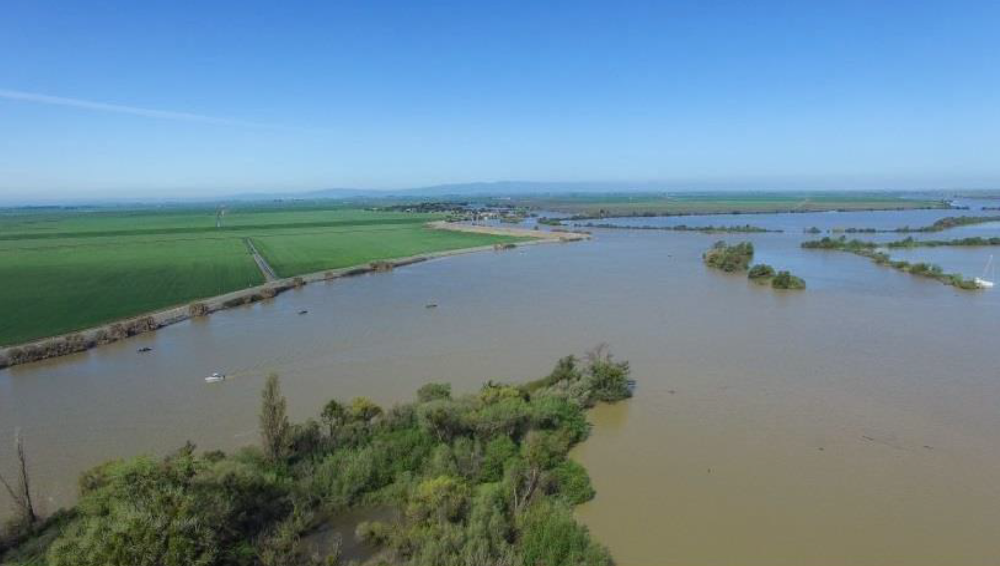

```{r setup, include=FALSE}
knitr::opts_chunk$set(echo = TRUE,
                      warning = FALSE, 
                      message = FALSE,
                      include = TRUE)

library(dataRetrieval) 
library(tidyverse)
library(here)
library(knitr)
library(patchwork)
library(readr)
library(feasts)
library(lubridate)
library(tsibble)
library(mapview)
library(sf)
library(jtools)
```

```{r load data, include=FALSE}

wq_data <- read_csv(here("data", "wq_data_cleaned.csv"))

wind <- read_csv(here("data", "wind_cleaned.csv"))

```

## Research Question
In the Cache Shag Slough Complex (CSC) in the San Francisco Estuary, does turbidity (as measured in Formazin Nephelometric Units) vary with wind speed (miles per hour) and tidal stage (using gage height as a proxy).

<figure>



<figcaption>

Some turbid water in Cache Shag Slough Complex.

</figcaption>

</figure>

### Introduction
**Overview:** In the lower San Francisco Estuary there is evidence of a decadal decrease in wind speed (Bever et al, 2017) from 1995 through 2015. This decrease in wind speed has been shown to be have corresponding effects on habitat, and specifically turbidity. I'm interested in understanding to what extent turbidity varies with with speed and tidal stage in the upper San Francisco Estuary.

**Background:** Turbidity is a metric of the total suspended soilds in the water column and is a measure of water clarity.  In freshwater systems, low turbidity is typically good because it indicates high water clarity and a healthy ecosystem.  On the reverse side, high turbidity is generally bad as it blocks sunlight from reaching aquatic plants and can smother aquatic organisms leading to plant die-offs.  High turbidity can also be a vector of contamination. For example, particles, pathogens, and other contaminates (lead, mercury) can adsorb to suspended solids and increase the distribution of contaminated sediments.

**Motivation:** However, not all turbid waters are equal. In estuaries, a healthy amount of turbidity is an important habitat condition. Without listing the suite of ecosystem services estuaries provide, spawning and rearing habitat for forage-fish species are major components. In the San Francisco Estuary, turbidity changes can have major management implications.  For example, the SF Estuary is home to the the endangered Delta Smelt, which is a fish species that thrivs in relatively high-turbidity water.  Another example is the management of development and restoration projects along the SF Estuary.  Understanding background conditions is important for setting water quality thresholds for work in and along the estuary.  The goal of this project is to understand if the relationship between turbidity, wind, and tidal stage hold true in the CSC Complex.

```{r, echo=FALSE, warning=FALSE}
cache <- st_read(here("data", "cache.kml"), quiet = TRUE)
```

```{r Figure1, echo=FALSE, fig.align = 'center', out.width = "30%", fig.cap = "Map of wind and water station locations in relation to CSC", results = 'markup'}
# load CSC polygon (created in Google Earth)

# bootstrap geometries
lat <- c(38.34917, 38.29167, 38.30786, 38.29415, 38.24301, 38.25611, 38.513, 38.378, 37.99)
lon <- c(-121.6447, -121.6308, -121.6924, -121.7257, -121.6843, -121.6667, -121.494, -121.962,-122.057)
id <- c("toe_drain", "miner", "shag", "hass", "cache", "sacramento", "Sacramento Execuative AP", "Vacaville Nut Tree AP", "Concord Buchanan AP")
type <- c("water quality","water quality","water quality","water quality","water quality","water quality","wind","wind","wind")

points <- as.data.frame(cbind(id, type,lat, lon))

# combine into single dataframe and convert columns to numeric
points <- points %>% 
  mutate(lat = as.numeric(lat),
         lon = as.numeric(lon)) %>% 
  as_tibble()

# convert to sf object
locations_sf <- st_as_sf(points, coords = c("lon", "lat"), crs = 4326)

# interactive map
 mapview(locations_sf["type"], layer.name = "Station Type") +
   mapview(cache, layer.name = "CSC")

# map imaage export
# mapshot(my_map, file = here("images", "map_plot.jpeg"))

```

### Hypothesis
My null hypotheses $(H_0)$ is that, in the CSC Complex, there is no relationship between hourly or daily turbidity compared to wind speed and gage height.

My alternative hypothesis $(H_a)$ is that, in the CSC Complex, there is a relationship between hourly or daily turbidity compared to wind speed and gage height.

Here is my regression equation:
$$Turbidity_i = B_0 + B_1WindSpeed_i + B_2GageHeight + u_i$$

### Data Sources and Cleaning

The CSC includes portions of the Yolo Bypass, a network of major and minor sloughs, agricultural land, and the Sacramento River/Deepwater Channel. Five water quality stations and three wind stations were used for the analysis.  This analysis expands upon the Bever et al. analysis by looking at the 2015 - 2021 time period. All stations were chosen based on location and data availability.

#### Turbidity & Gage Height Data
Turbidity and gage height data downloaded from the United States Geological Survey (USGS) via the ["dataRetrieval"](https://cran.r-project.org/web/packages/dataRetrieval/) R library. The library pulls hydrologic data from the National Water System Information System (NWIS) via the [National Water Dashboard](https://dashboard.waterdata.usgs.gov/app/nwd/?aoi=default). Data was generally available in 15-minute time intervals. However, turbidity data is typically messy due to sensor fouling and hence contains lots of data gaps. A fair amount of tidying was required. 

#### Wind Data

US Local Climatological Data (LCD) downloaded from [NOAA NCEI online portal](https://www.ncdc.noaa.gov/cdo-web/datatools/lcd) map tool.  Data available as hourly summaries from airport and other prominent weather stations. Data follows ISO 19115-2  Metadata standards for describing geographic information. 


#### Data Cleaning

Data for the three wind stations and six water quality stations were averaged together into hourly and daily averages, respectively. Those tables were merged together.

```{r transform wind data, include=FALSE}
# Wind data merge
wind_all <- wind %>% 
  group_by(DATE) %>% 
  summarize(HourlyWindSpeed = mean(HourlyWindSpeed)) %>% 
  mutate(station = "vaca_sac_concord")

# combine wind datasets as tsibble
wind_join <- rbind(wind, wind_all)
wind_tsbl <- wind_join %>% as_tsibble(key = station)

```

```{r transform water quality data, include=FALSE}
# water data merge
wq_data_all <- wq_data %>% 
  group_by(DATE) %>% 
  summarize(turbidity_fnu = mean(turbidity_fnu), 
            gage_height = mean(gage_height),
            slough="all")

```

```{r combine datasets, include=FALSE}
# wind and water data merge.  Filter for specific dates
df <- left_join(wq_data_all, wind_all, by = "DATE") %>% 
  filter(DATE > "2015-09-01 00:00:00") %>% 
  na.omit()

```


```{r create daily averages, include=FALSE}
# time period options: as.Date(.), yearweek(.), yearmonth(.), yearquarter(.), lubridate::floor_date(., "4 hour")

df_tsbl <- df %>% 
  as_tsibble %>% 
  group_by_key() %>% 
  
  # every day
  index_by(time = ~as.Date(.)) %>% 
  summarise(turbidity_fnu = mean(turbidity_fnu, na.rm = TRUE),
            gage_height = mean(gage_height, na.rm = TRUE),
            DailyWindSpeed = mean(HourlyWindSpeed, na.rm = TRUE)) %>% 
  na.omit()

```

```{r, include=FALSE}
hourly_plot <- ggplot(df, aes(x = DATE, y = turbidity_fnu)) +
  geom_line(size = 0.4, alpha = 0.8, show.legend = FALSE) +
  
  geom_line(data = df, aes(x = DATE, y = HourlyWindSpeed, color = "firebrick2"), alpha = 0.9, size = 0.3) +
  geom_line(data = df, aes(x = DATE, y = gage_height, color = "deepskyblue2"), alpha = 0.6) +
  ylim(0, 35) +
  scale_x_datetime(limits = as.POSIXct(c("2019-09-30", "2020-10-01"))) +
  labs(title = "Turbidity, Wind Speed, and Gage Height Comparison",
       subtitle = "Hourly Averages",
       x = "Date",
       y = "Turbidity, Wind, & Gage Height") +
  scale_color_discrete(name = "", labels = c("Gage Height (ft)", "Wind Speed (mph)"))

```


```{r Figure2, echo=FALSE, fig.align = 'center', out.width = "40%", fig.cap = "Correlation plots of turbidity compared to wind speed and gage height", results = 'markup'}
daily_plot <- ggplot(df_tsbl, aes(x = time, y = turbidity_fnu)) +
  geom_line(size = 0.4, alpha = 0.6) +
  geom_line(data = df_tsbl, aes(x = time, y = DailyWindSpeed, color = "firebrick2", col="Wind"), alpha = 0.9, size = 0.3) +
  geom_line(data = df_tsbl, aes(x = time, y = gage_height, color = "deepskyblue2"), alpha = 0.6) +
  ylim(0, 35) +
  scale_x_date(limits = as.Date(c("2019-09-30", "2020-10-01"))) +
  labs(subtitle = "Daily Averages",
       x = "Date") +
  ylab(NULL) +
  scale_color_discrete(name = "", labels = c("Gage Height (ft)", "Wind Speed (mph)"))

compare_plot <- (hourly_plot / daily_plot) + 
  plot_layout(guides = "collect")

# ggsave(here("images","compare_plot.png"))
compare_plot

```

### Statistical Analysis Plan

To assess whether turbidity varies with wind speed or gage height, I ran two linear regressions. One with hourly data and another with daily data. Analysis was completed in RStudio.

The general steps of this analysis plan include the following:
 1. Identify question
 2. Select independent and dependent variables(based on Bever et al, 2017)
 3. Data download, clean, and merge
 4. Visualize relationships
 5. Conduct regression
 6. Test OLS assumptions
 7. Interpret Results
 8. Conclusions and Future Research


### Visualize Relationships

```{r Figure3, echo=FALSE, fig.align = 'left', out.width = "40%", fig.cap = "Plot of turbidity over time", results = 'markup'}
# scatter plot with OLS regression line
turbidity_hourly <- ggplot(data = df, aes(x = DATE, y = turbidity_fnu)) +
  geom_point(size = 0.2, alpha = 0.1) +
  geom_smooth(method = lm, formula= y~x, se = FALSE) +
  labs(subtitle = "Turbidity (Hourly)",
       y = "Turbidity (FNU)",
       x = "Date")

turbidity_hourly

```
Relationship plots of turbidity and the two independent variables (wind speed and gage height) are included below. From 2015 to 2021, there is a decrease, on average, in hourly and daily turbidity levels.  We can see gage height has a strong positive correlation with turbidity for both hourly and daily data. We also can see clustering of gage height data, especially in the hourly data. We also observe a weak positive correlation between wind speed and turbidity. 

```{r Figure4, echo=FALSE, fig.align = 'left', out.width = "40%", fig.cap = "Correlation plots of turbidity compared to wind speed and gage height", results = 'markup'}
wind_plot_daily <- ggplot(data = df_tsbl, aes(x = DailyWindSpeed, y = turbidity_fnu, show.legend = FALSE)) +
  geom_point(size = 0.3, alpha = 0.1, show.legend = FALSE) +
  geom_smooth(method = lm, se = FALSE) +
  labs(title = "Wind Speed vs Turbidity",
       subtitle = "Daily",
       x = "Wind Speed (mph)",
       y = "Turbidity (FNU")

gage_plot_daily <- ggplot(data = df_tsbl, aes(x = gage_height, y = turbidity_fnu)) +
  geom_point(size = 0.3, alpha = 0.1, show.legend = FALSE) +
  geom_smooth(method = lm, se = FALSE) +
  labs(title = "Gage Height vs Turbidity",
       subtitle = "Daily",
       x = "Gage Height (feet)",
       y = "Turbidity (FNU)")


wind_plot_hourly <- ggplot(data = df, aes(x = HourlyWindSpeed, y = turbidity_fnu, show.legend = FALSE)) +
  geom_point(size = 0.3, alpha = 0.1, show.legend = FALSE) +
  geom_smooth(method = lm, se = FALSE) +
  labs(subtitle = "Hourly",
       x = "Wind Speed (mph)",
       y = "Turbidity (FNU")

gage_plot_hourly <- ggplot(data = df, aes(x = gage_height, y = turbidity_fnu)) +
  geom_point(size = 0.3, alpha = 0.1, show.legend = FALSE) +
  geom_smooth(method = lm, se = FALSE) +
  labs(subtitle = "Hourly",
       x = "Gage Height (feet)",
       y = "Turbidity (FNU)")

(wind_plot_daily + gage_plot_daily) / (wind_plot_hourly + gage_plot_hourly) +
  theme_minimal()

```

```{r Figure5, echo=FALSE, fig.align = 'left', out.width = "50%", fig.cap = "Histogram and box plots of independnet and dependent variables", results = 'markup'}
# Histograms
hist_turbidity<- ggplot(data = df, aes(x = turbidity_fnu)) +
  geom_histogram(bins = 40) +
  labs(x = "Turbidity (FNU)")
hist_wind <- ggplot(data = df, aes(x = HourlyWindSpeed)) +
  geom_histogram(bins = 40) +
  labs(x = "Wind Speed (mpg)")
hist_gage <- ggplot(data = df, aes(x = gage_height)) +
  geom_histogram(bins = 40) +
  labs(x = "Gage Height (ft)")

# boxplots
box_turbidity<- ggplot(data = df, aes(x = turbidity_fnu)) +
  geom_boxplot(outlier.colour="red", outlier.shape=3,
                outlier.size=4) +
  labs(x = "Turbidity (FNU)")
box_wind <- ggplot(data = df, aes(x = HourlyWindSpeed)) +
  geom_boxplot(outlier.colour="red", outlier.shape=3,
                outlier.size=4) +
  labs(x = "Wind Speed (mpg)")
box_gage <- ggplot(data = df, aes(x = gage_height)) +
  geom_boxplot(outlier.colour="red", outlier.shape=3,
                outlier.size=4) +
  labs(x = "Gage Height (ft)")


explore_plots <- (hist_turbidity + hist_wind + hist_gage) / 
  (box_turbidity + box_wind + box_gage) + 
  plot_annotation(title = "Histogram and Boxplots",
                  caption = 'Source: NOAA NCEI and USGS',
                  tag_levels = 'A')
explore_plots
```

### Regression Analysis & Interpretation

**Hourly Data**

```{r regression on hourly data, echo=FALSE, results='markup'}
model_hourly <- lm(turbidity_fnu ~ HourlyWindSpeed + gage_height, data = df)

summ(model_hourly, digits = 5)
```


**Daily Data**

```{r regression on daily data, echo=FALSE, results='markup'}
model_daily <- lm(turbidity_fnu ~ DailyWindSpeed + gage_height, data = df_tsbl)

summ(model_daily, digits = 5)
```

**Intercept $(B_0)$**:  Tells us the predicted turbidity is -1.45 FNU when wind speed and gage height is zero. Logically this does not make sense as the turbidity scale typically ranges from 0 to ~500. 

**Coefficient on wind speed $(B_1)$**: There's a predicted increase of 0.15-0.23 turbidity units (FNU) for every mile-per-hour increase in wind speed, holding the gage height fixed.

**Coefficient on gage height $(B_2)$**: There's a predicted increase of 1.01-1.07 turbidity units (FNU) for every foot increase in gage height, holding the wind speed fixed.

**Adjusted $R^2$**:  About 9-10% of the variation in turbidity can be explained by wind speed and gage height. Though turbidity data was filtered to remove values over 300 FNU, there are still many extreme turbidity events that approach this outlier threshold.  Adjusted $R^2$ is very sensitive to outliers so it makes sense we have a low value.

**P-Value**: For both the hourly and daily regressions we reject the null hypothesis that wind speed and gage height has an effect of 0 on turbidity. With hourly data, $p-value < 0.000$.  For the daily data, we get $p-value < 0.000$ for gage height and $p-value < 0.03$ for wind speed.  We can say there is a **statistically significant correlation** for both variables. 

### Testing OLS Assumptions

We can assume assumption 1 (linear relationship) and 2 ($X$ variables are exogenous $\mathop{\boldsymbol{E}}\left[ u \mid X \right] = 0$) of OLS hold up.  However, the linear relationship is week.  Assumption 3 requires our $X$ variables to have variation.  Based on the relationship plots above, we can see this holds true. 

Assumption 4 of OLS is more difficult to prove.  It requires population disturbances $u_i$ to be independently and identically distributed as normal random variables with mean zero and variance $\sigma^2$.  To test assumption 4 I will generate residuals from the daily regression model and plot them.

```{r Figure6, echo=FALSE, fig.align = 'center', out.width = "40%", fig.cap = "Histogram and box plots of independent and dependent variables", results = 'markup'}
# create predictions and residuals
predictions <- df %>% modelr::add_predictions(model_hourly) %>%
  mutate(residuals = turbidity_fnu-pred)

# histogram of residuals
resid_hist <- ggplot(data=predictions, aes(x = residuals)) + 
  geom_histogram(fill = "firebrick2", col = "black", alpha = 0.8, binwidth = 4) +
  labs(subtitle = "Residual Plot")

# qq-plot
qq_plot <- ggplot(predictions, aes(sample = residuals)) +
  geom_qq(color = "deepskyblue3") +
  geom_qq_line() +
    labs(subtitle = "Q-Q Plot",
       x = "Theoretical Quantiles",
       y = "Standardized Residuals")

(resid_hist / qq_plot)
```

The residuals are not normally distributed as there is a long right tail with high outliers.  This indicates that the regression analysis is under-predicting average hourly turbidity levels.  The Q-Q Plot indicates the distribution is generally normally distributed for values up to the positive 1 theoretical quantile.  This suggests that the model is not normally distributed for extreme high values.


### Conclusions and Future Analysis

This analysis indicates that wind speed and tidal stage (gage height) correlate with higher turbidity levels at both the hourly and daily intervals. However, based on the adjusted $R^2$ value, ommited variable bias is likely an issue. Two critical omitted variables we could add to the model are upstream sediment loading, wind-wave resuspension, and an interaction between some of the variables. 

Based on the residual plot, assumption 4 of OLS may not be satisfied and OLS may not be the estimator with the lowest variance.  Also, because OLS is sensitive to outliers, I removed all values over 300 FNU in the turbidity dataset. This helped with the analysis, but still limits the use of OLS with the dataset. An alternative to removing values is to winsorize the dataset such that all extreme values are capped at a specified percentile range. Another option could be to chooose a different regression technique. Partial least squares (PLS) is helpful when comparing multiple continuous dependent variables or when the independent variables are highly correlated.  If wind-wave resuspension was added in a future analysis, PLS may prove to be a better regression method.

Break time variable up into categorical years + month columns so you could compare correlation on turbidity between  months of the year.  Wind speed in the Delta is relatively low during the late fall and winter months and then increases during the spring and summer (Schoellhamer et al. 2016).

### References

Bever, Aaron J., Michael L. MacWilliams, and David K. Fullerton. 2018. “Influence of an Observed Decadal Decline in Wind Speed on Turbidity in the San Francisco Estuary.” Estuaries and Coasts 41 (7): 1943–67. https://doi.org/10.1007/s12237-018-0403-x.

Schoellhamer, D.H., G.G. Shellenbarger, M.A. Downing-Kunz, and A.J. Manning. 2016. Review of Suspended sediment in lower south Bay relevant to light attenuation and phytoplankton blooms. In Lower South Bay Nutrient Synthesis. San Francisco Estuary Institute & Aquatic Science Center, pp. 23–56.


