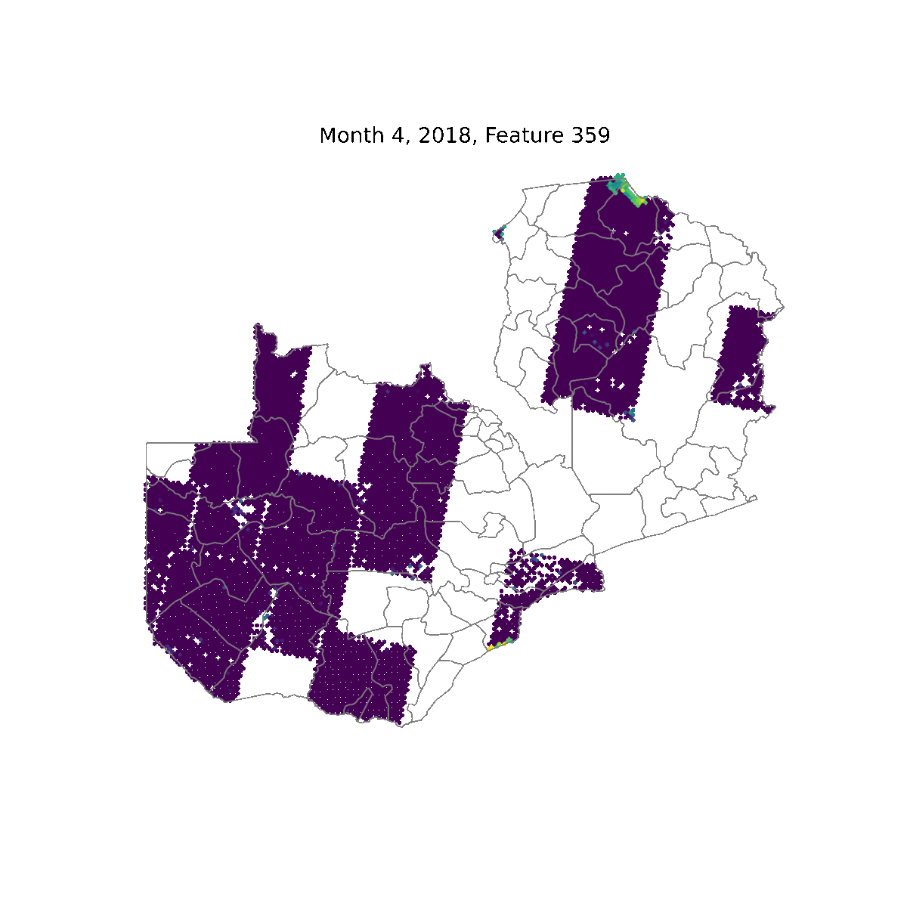

```{r setup, include=FALSE}
knitr::opts_chunk$set(echo = FALSE)
library(here)
```

The [MEDS Capstone Public Presentation](https://bren.ucsb.edu/masters-programs/master-environmental-data-science/meds-capstone-projects) is the cornerstone and culmination of the [Master of Environmental Data Science](https://bren.ucsb.edu/masters-programs/master-environmental-data-science) program at the Bren School of Environmental Science & Management at UCSB. The capstone process pairs students in teams 2 to 4 to tackle  environmental problems using open-data science practices and principles. These projects enable us to showcase our data science chops while managing all stages of a data science driven project. As if your are you own consultant offering your services, students manage client communication, expectations, timelines, deliverables, product & project updates, and communicating that science to a technical and non-technical audience.

Check out all of the awesome capstone projects of the MEDS 2022 cohort by clicking  [here](https://bren.ucsb.edu/projects?f%5B0%5D=project-program%3A63).

## CropMOSAIKS

My capstone group created an open-source pipeline that combines satellite imagery, machine learning, and regression to predict crop yields over time. This pipeline adapts and expands upon the MOSAIKS framework described by [Rolf et al. 2020](https://www.nature.com/articles/s41467-021-24638-z). Simplified, the pipeline is a two-step process. In step 1, satellite imagery is encoded using the random convolutional features approach. In step 2, we combine the geo-located features with geo-located crop yield data to train a model and run cross-validated ridge regression. The primary contributions of this work include the following:

  1. demonstrating MOSAIKS utility in the agricultural sector,
  2. processing monthly public satellite imagery (Landsat missions and Sentinel 2), and
  3. optimizing the pipeline using [Microsoft Planetary Computer](https://planetarycomputer.microsoft.com/)

{width="50%"}

Our capstone group consisted of four graduate students:

  - myself, [Steven Cognac](https://bren.ucsb.edu/people/steven-cognac), 
  - [Juliet Cohen](https://bren.ucsb.edu/people/juliet-cohen), 
  - [Grace Lewin](https://bren.ucsb.edu/people/grace-lewin), and 
  - [Cullen Molitor](https://bren.ucsb.edu/people/cullen-molitor). 

### Title: An open-source pipeline for remote sensing of crop yields: a Zambia case study

### Link: [YouTube Public Presentation Recording](https://youtu.be/iXdETegKbSs?t=4372)

### Codebase: [CropMOSAIKS GitHub](https://github.com/cropmosaiks)

### Abstract
High-quality, long-term environmental data sets are the foundation of long-range risk and climate modeling. However, producing such datasets is costly, logistically challenging, and resource-intensive. Due to limited agricultural data across sub-Saharan Africa, policy-makers, farmers, and researchers are currently unable to accurately forecast short-run food security risks posed by weather anomalies and long-run climate change projections. Recent machine learning approaches applied to high-resolution satellite imagery have successfully modeled various social and environmental variables. Here, we expand upon a recently developed machine learning approach to build a model that predicts maize yields over time using public satellite imagery. We developed a generalizable pipeline from survey data through a use case for predicting maize yields in Zambia. In 2020 and 2021, the Zambia Statistics Agency could not survey maize growers due to the COVID-19 pandemic. We use our model to fill in this data gap of maize yield predictions during these years. Through parameter optimization, we selected the model with the best ability to predict over space and time. Our model performed better overall relative to its predictive performance over time. The processed satellite imagery, predictions, and pipeline serve as a tool for the research community and users interested in analyzing Zambia's current and future food security risks. This pipeline further enables users to explore global and region-specific questions at scale.

### Acknowledgements
  - Bren School: Tamma Carleton, Assistant Professor; Brad Hill, IT Director; Allison Horst, Assistant Teaching Professor; Kat Le, Technical Applications Manager
  - Jonathan Proctor, postdoctoral fellow at the Harvard Data Science Initiative and the Center for the Environment
  - Baylis Lab, University of California, Santa Barbara
  - Zambia Statistics Agency
  - Microsoft Planetary Computer: Caleb Robinson, Tom Augsburger