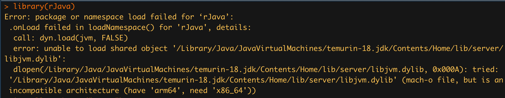
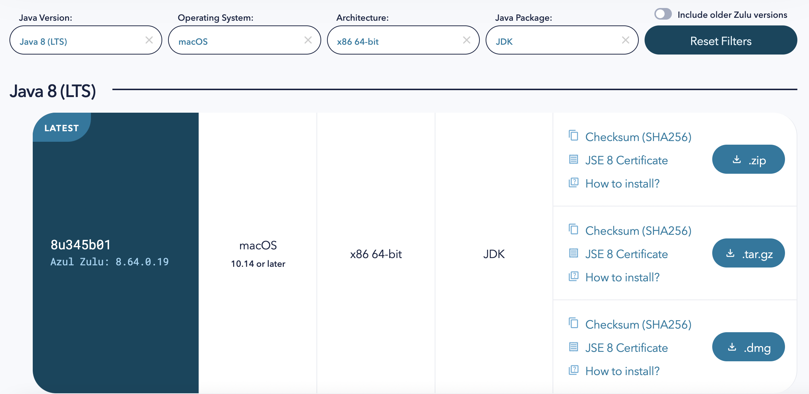

```{r setup, include=FALSE, warning=FALSE, message=FALSE}
knitr::opts_chunk$set(echo = FALSE)
library(here) # file referencing in project-oriented workflows
library(tidyverse) # data wrangling & visualizations (will use: 'dplyr', 'purrr'. 'ggplot2', 'readr')
library(tidyr)
library(DT) # interface to the JavaScript library 'DataTables'
```

In this post I'll go through an introduction to species distribution modeling (SDM) using the `dismo` package. These are machine learning (algorithm) based approaches. We'll go through the steps of acquiring observation data, generating absence points, gathering underlying climate data, and making predictions.

Here, we'll use an SDM to make inferences about the distribution of suitable habitat for a species of interest. There are many SDM approaches out there all with their own pros and cons. Check out this [table comparing different SDM options](https://www.seascapemodels.org/SDM-fish-course-notes/2021-09-20-SDM-fish-course.html#comparison-of-some-different-sdm-options). Further, there are many limitations of SDMs (list articles here), their ability to gain ecological insight and predict species distribution across a landscape is valuable.

For this exercise we'll use the blue oak (*Quercus douglasii*) tree. Blue oak trees are native and and endemic to California. They occur with a narrow range along the valleys and slopes of the mountain ranges that surround the Central Valley in California.

](images/blue_oak.jpeg)

The steps we'll follow to for out SDM are as follows:

-   Collect species occurrence data
-   Gather cliamte raster data
-   Crop climate data to California
-   Run MaxEnt Model
-   Calibrate model and re-run MaxEnt

## Installing Packages

```{r, library setup}

library(spocc) # extract species occurrence data
library(sdmpredictors) # get environmental raster data
library(rJava)

library(leaflet) # interactive mapping
library(leafem) # leaflet html plugins
library(mapview) # interactive mapping
library(raster) # raster data manipulation
library(sf) # spatial vector data manipulation
library(USAboundaries) # grab state boundaries

library(usdm) # uncertainty analysis for species distribution models: vifcor()
library(dismo) # species distribution modeling: maxent(), predict(), evaluate()

# overwrite raster::select
select <- dplyr::select 

# set random seed for reproducibility
set.seed(58)

# directory to store data
dir_data <- here("2022-08-04-speciesdistmodeling/data")
dir.create(dir_data, showWarnings = F, recursive = T)

```

If you are having problems installing the `rJava` package like so:

{width="70%"}

Here are some troubleshooting options for installation on a macOS Monterey with an M1 architecture (ymmv).

-   [Stack overflow](https://stackoverflow.com/questions/67849830/how-to-install-rjava%20-package-in-mac-with-m1-architecture) post. This got me 99% of the way there. I had to uninstall the latest JDK (19) and downgrade to Java 8. I have detailed steps below on this.
-   Check out the [R installation guide for Java Support](https://cran.r-project.org/doc/manuals/r-patched/R-admin.html#Java-support)
-   Helpful background on Java and MacOS Monterey - [Wolf Paulus's blog](https://wolfpaulus.com/installing-java-on-macos/).
-   Here's another helpful run through on [ [Zhiyzuo's blog](https://zhiyzuo.github.io/installation-rJava/).

Here are the steps I took to get `rJava` working:

1.  Uninstall `rJava` with `remove.packages()`.
2.  Download Java 8 (LTS) x86_64-bit JDK for MacOS from [Azul Core Platform](https://www.azul.com/downloads/?version=java-8-lts&os=macos&architecture=x86-64-bit&package=jdk) {width="60%"}.
3.  Run `R CMD javareconf` in the terminal. This reconfigures JAVA_HOME directories.
4.  Re-install `rJava` in Rstudio and voila.

## Exploring Species Data

We'll set up our file structure here.

```{r, file setup}
# raw species data
obs_csv <- here(dir_data, "obs_csv.csv")
obs_geo <- here(dir_data, "obs_geo.geojson")
```

Let's download our species data. We'll limit it to the Global Biodiversity Information Facility (GBIF) data library using the `spocc::occ` function. Other data repositories are available (iNaturalist, eBird, Bison, iDigBio), but a lot of that data eventually ends up in GBIF. We'll filter our results for CA only observations (native range) and remove "PRESERVED_SPECIMEN" which are Herbaria records. in CA To do this we'll We then take the obs_csv dataframe and covert it to a spatial object using our coordinate data.

The function `file.exists()` returns a logical vector. I'll use that notation to avoid re-downloading/re-creating files each time the document is compiled.

```{r, download data}
redo <- FALSE

# get species occurrence data from GBIF
if(!file.exists(obs_csv) | redo){
  res <- spocc::occ(
  limit = 10000, # default is 500
  query = 'Quercus douglasii', 
  from = 'gbif', has_coords = T)
  
  # extract data frame from result
  oak_df<- res$gbif$data[[1]] 
  
  # create .csv file of raw data
  readr::write_csv(oak_df, obs_csv)
  
  # convert to points of observation from lon/lat columns in data frame
  obs <- oak_df |> 
    sf::st_as_sf(
      coords = c("longitude", "latitude"),
      crs = st_crs(4326)) |> 
    
    # filter for observations only in native range (i.e. California) and not in an herbarium 
    filter(stateProvince == "California",
           basisOfRecord != "PRESERVED_SPECIMEN") |> 
    
    # there are 144 columns and we don't need them all
    select(key, basisOfRecord, occurrenceStatus, kingdom,
           phylum, order, family, species, stateProvince,
           eventDate, references)
  
  # create sf object
  sf::write_sf(obs, obs_geo)
}

# read in geo data
obs <- sf::read_sf(obs_geo)
```

```{r, view results}
# show points on map
mapview::mapview(obs, map.types = "OpenTopoMap")
```

## Selecting Environmental Data

We'll now get the underlying climate data for our SDM.

```{r, view climate data}
dir_env <- here(dir_data, "env")

# set a default data directory
options(sdmpredictors_datadir = dir_env)

# choosing terrestrial
env_datasets <- sdmpredictors::list_datasets(terrestrial = TRUE, marine = FALSE)

# show table of datasets
env_datasets |>  
  select(dataset_code) |> 
  DT::datatable()
```

We'll use the two terrestrial datasets, "WorldClim" and ENVIREM".

```{r, get climate data}
# choose datasets for a vector
env_datasets_vec <- c("WorldClim", "ENVIREM")

# get layers
env_layers <- sdmpredictors::list_layers(env_datasets_vec)
DT::datatable(env_layers, options = list(
  pageLength = 5, lengthMenu = c(5, 10, 15, 20)
))
```

There are 86 layers to choose from. Not all of them are needed so let's select a few layers that are most relevant. We'll use:

| Layer Code | name                    | description                               |
|-------------------|:-------------------|---------------------------------|
| WC_alt     | Altitude                | Altitude                                  |
| WC_bio1    | Annual mean temp        | Annual mean temp                          |
| WC_bio2    | Mean diurnal temp range | Mean of the monthly (max temp - min temp) |
| WC_bio6    | Minimum temp            | Minimum temp of the coldest month         |
| WC_bio12   | Annual precipitation    | Annual precipitation                      |
| ER_tri     | Terrain roughness index | Terrain roughness index                   |
| ER_topoWet | Topographic wetness     | SAGA-GIS topographic wetness index        |

```{r, climate data selection}
# choose layers after some inspection and perhaps consulting literature
env_layers_vec <- c("WC_alt", "WC_bio1", "WC_bio2", "WC_bio6", 
                    "WC_bio12", "ER_tri", "ER_topoWet")

# get layers
env_stack <- load_layers(env_layers_vec)

# interactive plot layers, hiding all but first (select others)
# mapview(env_stack, hide = T) # makes the html too big for Github
plot(env_stack, nc=2)
```

These raster layers are currently global. Let's crop the environmental rasters to a reasonable study area. There are two good options to clip our rasters: 

1. create a convex hull around our species observations using the `sf` package (`sf::st_convex_hull(st_union())`) 
2. use the boundary of California. We'll use this second option grabbing boundaries from the `USAboundaries` package

```{r, cropping environmental data}
# two spatial files we'll generate
ca_geo  <- here(dir_data, "ca_geo.geojson")
env_stack_grd <- here(dir_data, "env_stack.grd")

if (!file.exists(ca_geo) | redo){
  # make convex hull around points of observation
  ca_border <- USAboundaries::us_states(states = "California", resolution = "high")
  
  # save obs hull
  write_sf(ca_border, ca_geo)
}
ca_geo <- read_sf(ca_geo)

# show points on map
mapview(
  list(obs, ca_geo), map.types = "OpenTopoMap")

```

Now let's clip our environmental layers to this bounding box.

```{r, clip rasters}

if (!file.exists(env_stack_grd) | redo){
  ca_geo_sp <- sf::as_Spatial(ca_geo)
  env_stack <- raster::mask(env_stack, ca_geo_sp) |> 
    raster::crop(extent(ca_geo_sp))
  writeRaster(env_stack, env_stack_grd, overwrite=T)  
}
env_stack <- stack(env_stack_grd)

# show map
# mapview(obs) +
#   mapview(env_stack, hide = T) # makes html too big for Github

plot(env_stack, nc=2)
```


## Extract Raster values from Observations

```{r, extract_env_points}
pts_geo     <- here(dir_data, "pts.geojson")
pts_env_csv <- here(dir_data, "pts_env.csv")

if(!file.exists(pts_env_csv) | redo){
  # create simple dataframe
  pts <- rbind(
    obs |> 
      mutate(present = 1) |> 
      select(present, key)) |> 
    mutate(ID = 1:n()) |> 
      relocate(ID)
  write_sf(pts, pts_geo, delete_dsn=T)
  
  # extract raster values for points
  pts_env <- raster::extract(env_stack, as_Spatial(pts), df=TRUE) |>
    tibble() |> 
    # join present and geometry columns to raster value results for points
    left_join(
      pts |> 
        select(ID, present),
      by = "ID")  |>  
    relocate(present, .after = ID) |> 
    # extract lon, lat as single columns
    mutate(
      #present = factor(present),
      lon = st_coordinates(geometry)[,1],
      lat = st_coordinates(geometry)[,2]) |> 
    select(-geometry)
  write_csv(pts_env, pts_env_csv)
  
}
pts_env <- read_csv(pts_env_csv)

pts_env |> 
  DT::datatable()
```

This table above is the \*\*data\* that feeds into our SDM (y \~ X), where: *y* is the present column with values of 1 (present) and *X* is all other columns: WC_alt, WC_bio1, WC_bio2, WC_bio6, WC_bio12, ER_tri, ER_topoWet, lon, lat

## MaxEnt (Maximum Entropy) Model

Maxent is probably the most commonly used species distribution model ([Elith 2011](https://onlinelibrary.wiley.com/doi/10.1111/j.1472-4642.2010.00725.x)) since it performs well with few input data points, only requires presence points (and samples background for comparison) and is easy to use with a Java graphical user interface (GUI).

MaxEnt requires presence-only observation points.

```{r}
mdl_maxent_rds <- here(dir_data, "mdl_maxent.rds")

# show version of maxent
if (!interactive())
  maxent()

# get presence-only observation points (maxent extracts raster values for you)
obs_sp <- read_sf(obs_geo) |>  
  sf::as_Spatial() # maxent prefers sp::SpatialPoints over newer sf::sf class

# fit a maximum entropy model
if (!file.exists(mdl_maxent_rds)){
  mdl <- maxent(env_stack, obs_sp)
  readr::write_rds(mdl, mdl_maxent_rds)
}
mdl <- read_rds(mdl_maxent_rds)

# plot variable contributions per predictor
plot(mdl)
```
In our *Variable Contribution* plot we are checking out the percentage our environmental predictors contribute in our model. We see here that the top three predictors *WC_bio12, WC_bio6, and WC_bio1* contribute approximately 90%.

## Response Curves

Response curves show how each environmental variable affects the MaxEnt prediction and how that prediction changes as each variable is varied. The default in the `dismo::response` package is vary one variable while setting all other environmental variables to their mean. In other words, the curves show the marginal effect of changing exactly one variable.

```{r}
# plot response curves
dismo::response(mdl)
```


Let's make raw predictions of for species location

## Generate Raw Predictions
```{r}
# predict
y_predict <- predict(env_stack, mdl) #, ext=ext, progress='')

plot(y_predict, main='Maxent, raw prediction')
data(wrld_simpl, package="maptools")
plot(wrld_simpl, add=TRUE, border='dark grey')
```


## Model Calibration

While these raw results are a good start, it's important to calibrate your model. It is critical to check for multicollinearity between independent variables in your model. When you have multiple independent variables (in our case, our _X_ values) that have high intercorrelation, this can lead to skewed or misleading results. This essentially widens your confidence intervals to produce less reliable results.

We first use a *pairs* plot to identify pairwise correlations between variables to identify pairs or groups of variables that are highly correlated. You can see below we have some strongly correlated variables. For our model, we'll set our pairwise correlation threshold at 0.7.
```{r, pairs plots}
# show pairs plot before multicollinearity reduction
raster::pairs(env_stack)
```

We can detect multicollinearity (strong correlation between two or more independent variables) with a Variance Inflaction Factor (VIF) with the `usdm::vif()` function. A value with a VIF greater than 10 indicates that our model has a collinearity problem. We can reduce 

```{r, calc VIF}
# calculate VIF per predictor
vif(env_stack) |> 
  DT::datatable()
```

We see that *WC_alt, WC_bio1, and WC_bio6* all have VIF greater than 10. Let's remove those from our raster stack.

```{r, remove collinearity}
# stepwise reduce predictors, based on a max correlation of 0.7 (max 1)
v <- vifcor(env_stack, th=0.7) 
v

# reduce enviromental raster stack by 
env_stack_v <- usdm::exclude(env_stack, v)

# show pairs plot after multicollinearity reduction with vifcor()
pairs(env_stack_v)
```

Let's re-compute our 

```{r}
mdl_maxv_rds  <- here(dir_data, "mdl_maxent_vif.rds")

# fit a maximum entropy model
if (!file.exists(mdl_maxv_rds)){
  mdl_maxv <- maxent(env_stack_v, obs_sp)
  readr::write_rds(mdl_maxv, mdl_maxv_rds)
}
mdl_maxv <- read_rds(mdl_maxv_rds)

# plot variable contributions per predictor
plot(mdl_maxv)
```

```{r}
# predict
y_maxv <- predict(env_stack, mdl_maxv) #, ext=ext, progress='')

plot(y_maxv, main='Maxent, final prediction')
data(wrld_simpl, package="maptools")
plot(wrld_simpl, add=TRUE, border='dark grey')
```


```{r, maxent predictions}

pal <- colorNumeric(
  palette = c('#313695','#4575b4','#74add1','#abd9e9','#e0f3f8','#fee090','#fdae61','#f46d43','#d73027','#a50026'),
  values(y_maxv),
  domain = c(0, 1), 
  na.color = "transparent"
)

 # obs_pal <- colorNumeric(palette = "green",
 #                        domain = pts$present)

map <- leaflet() |> 
  addTiles() |> 
  addProviderTiles("Esri.WorldImagery") |> 
  
  # add MaxEnt predictions
  addRasterImage(x = y_maxv, 
                 project = TRUE, 
                 layerId = "MaxEnt", 
                 colors = pal,
                 opacity = 0.5) |> 
  
  # add species observations
  addCircleMarkers(data = obs, radius = 1, fill = TRUE, color = "green") |> 
  addPolylines(data = ca_geo) |> 

  addLegend(pal = pal, values = values(y_maxv), title = "MaxEnt Predictions") |>
  # addLegend(pal = obs_pal, values = values(pts), title = "Blue Oak Observations") |> 
  
  # add measure
  addMeasure() |> 
  addHomeButton(extent(obs), "observations")


map


```

```{r}
mapview(obs, map.types = "OpenTopoMap", alpha = 0.1) +
  mapview(y_maxv, col.regons = pal(100))
```
