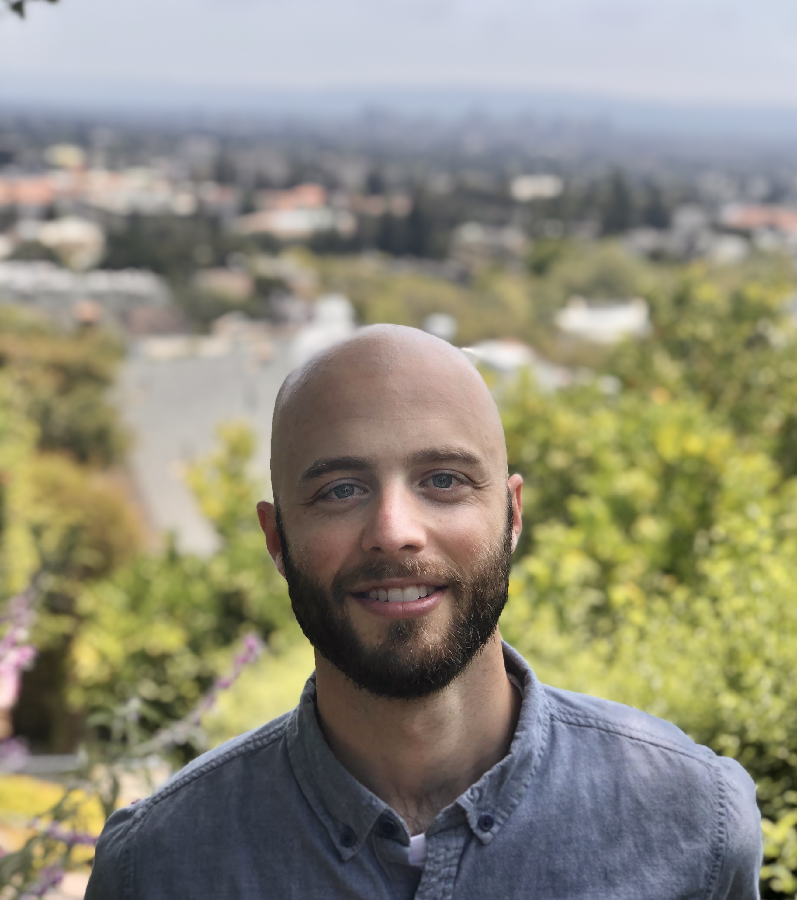

{width=25%} 

## Professional
Worked as a biologist and wetland scientist for over 7 years in the private and non-profit sectors. I'm a master's student in the [MEDS](https://bren.ucsb.edu/masters-programs/master-environmental-data-science) program at UCSB where my capstone work focuses on predicting crop yields in sub-Saharan Africa by combining satellite imagery and machine learning.

## Personal
East coast transplant (Massachusetts) living in beautiful Santa Barbara, California. I don't have much free time as a current student, but when I do you can find me botanizing the Santa Ynez Mountains  [</i>](https://www.calflora.org/cgi-bin/contrib_profile.cgi?seq=113317), playing pick-up soccer, or kite surfing the point at Leadbetter Beach. 

## Contact
Interested in chatting? Feel free to contact me on [email](mailto:scognac@bren.ucsb.edu){target="_blank"}, [Twitter](https://twitter.com/Cognack_){target="_blank"}, or [LinkedIn](https://www.linkedin.com/in/steven-cognac-24542658/){target="_blank"}. I'm open to work opportunities and look forward to hearing from you!
