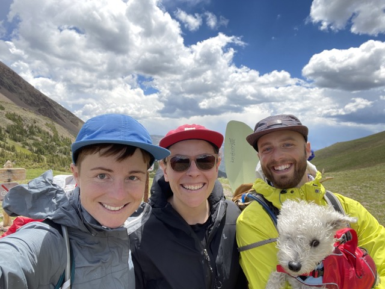

```{r setup, include=FALSE}
knitr::opts_chunk$set(echo = FALSE)
library(here)
```

<center>

<font size="5">

I am an environmental data scientist with a background in environmental consulting, wetland restoration and permitting, and water resources management.

{width="45%"}

</font>

</center>

<center>

## Education

I received my B.S. from the University of Massachusetts Amherst in 2014 with a dual degree in Environmental Science and Sustainable Food & Farming. There I grew my interests in sustainable agriculture, wetland conservation, and the impacts of climate change on the environment and ecosystem services. In June 2022, I graduated from UCSB's [Master of Environmental Data Science (MEDS)](https://bren.ucsb.edu/masters-programs/master-environmental-data-science) program. For my capstone, I created an [open-source pipeline for remote sensing of crop yields](https://bren.ucsb.edu/projects/open-source-pipeline-remote-sensing-crop-yields-zambia-case-study), with Zambia as a case study.

## Professional

Before the MEDS program, I worked in environmental consulting as a scientist, otherwise known as a jack-of-all-trades (i.e., biologist, wetland scientist, environmental analyst, environmental planner, water quality specialist, construction monitor, etc.). I was in these roles for around six years. I managed ecological restoration projects, prepared a litany of environmental permitting and planning reports, and carried out rare and invasive plant monitoring.

## Personal

I'm an east coast transplant from Lowell, Massachusetts, living in beautiful Santa Barbara, California. I love to kitesurf 🪁🏄‍, cook 👨‍🍳, botanize 🌿, read and learn new things 📚, play soccer ⚽, hike around 🥾, and bike around 🚲.

{width="25%"} {width="25%"} {width="25%"} {width="44%"} {width="25%"} {width="25%"}

## Contact

Interested in connecting? Feel free to contact me by [email](mailto:scognac@bren.ucsb.edu){target="_blank"}, [Twitter](https://twitter.com/Cognack_){target="_blank"}, or [LinkedIn](https://www.linkedin.com/in/steven-cognac-24542658/){target="_blank"}. I'm open to work opportunities and look forward to hearing from you!

</center>
